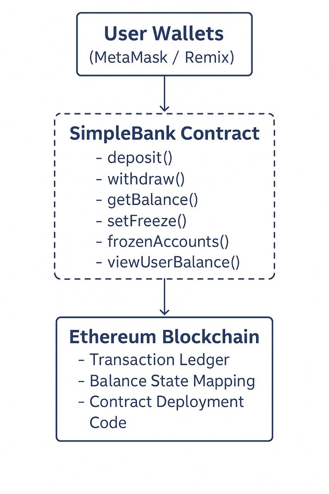
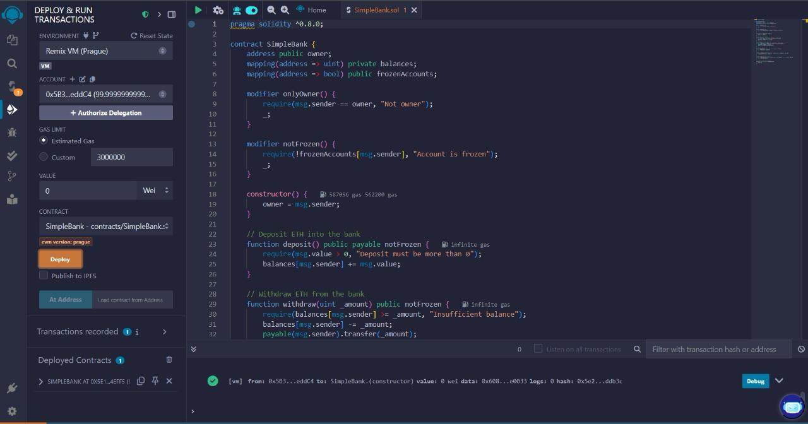
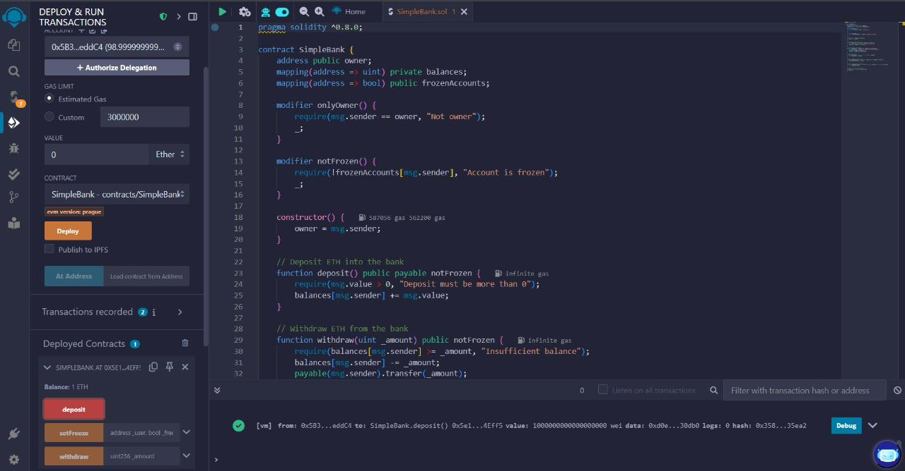
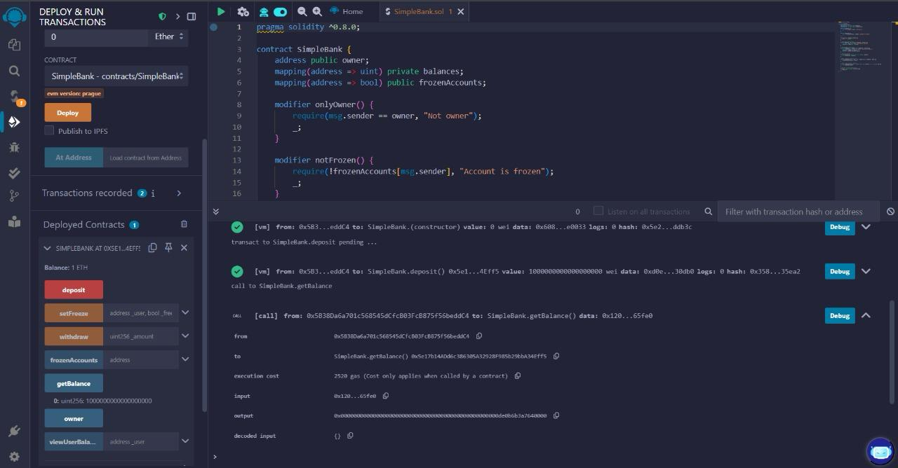
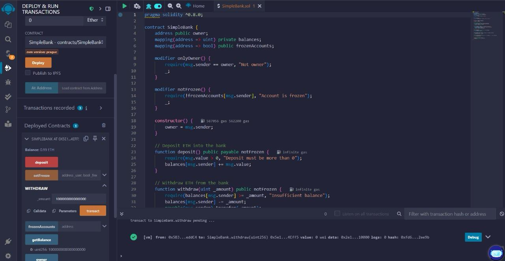
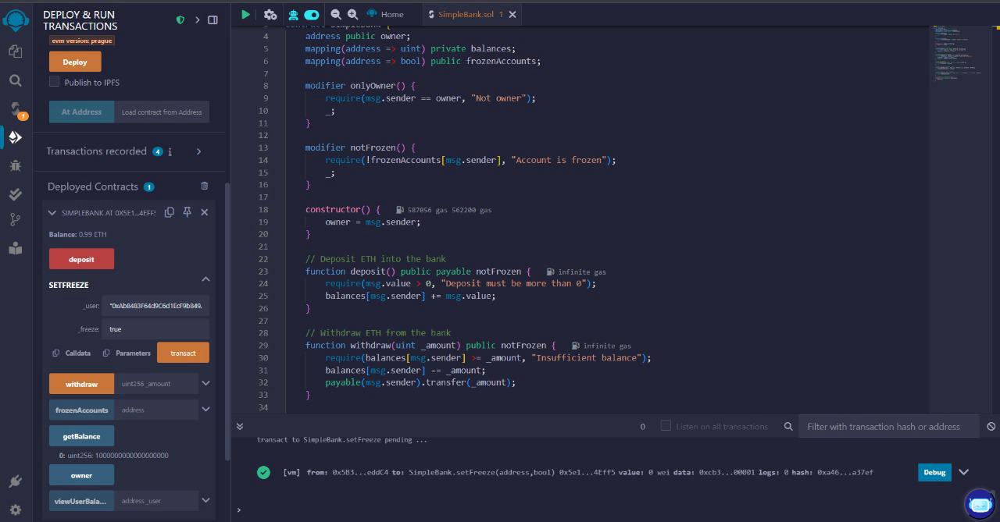
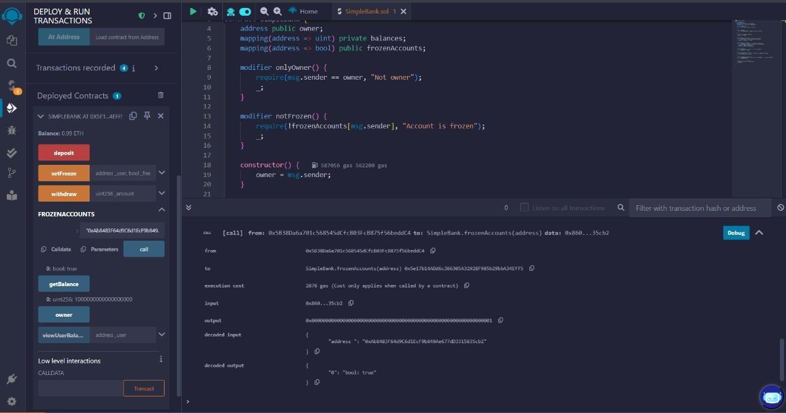

# 🏦 SimpleBank – A Secure Ethereum-Based Smart Contract for Banking Operations

## 📌 Overview

**SimpleBank** is a smart contract developed on the Ethereum blockchain using Solidity. 
It replicates fundamental banking functions like deposit, withdrawal, balance checking, 
and includes administrative capabilities such as freezing user accounts and viewing balances.

This project simulates how decentralized technologies can deliver transparent, secure, 
and user-controlled financial services without the need for centralized intermediaries.

---

## ✅ Objectives

- Create a basic yet secure Ethereum smart contract for banking operations.
- Enable Ether deposit and withdrawal with real-time on-chain tracking.
- Implement administrative controls like account freezing and user balance viewing.
- Enforce security and role-based access using Solidity modifiers.
- Illustrate the role of smart contracts in decentralized finance (DeFi).

---

## 🔧 Features

- 🔐 **Secure Ether Management** – Users can deposit and withdraw ETH.
- 🧊 **Account Freezing** – Admins can restrict accounts from transacting.
- 👮 **Admin Access Controls** – `onlyOwner` and `notFrozen` modifiers enforce permissions.
- 📜 **View Balances** – Admins can check balances of any user.
- 📖 **Transparent Transaction History** – Every action is stored immutably on-chain.

---

## 🛠 Tech Stack

| Tool        | Purpose                              |
|-------------|---------------------------------------|
| Solidity    | Smart contract development            |
| Remix IDE   | Deployment and testing environment    |
| MetaMask    | Wallet interface for interaction      |
| Ethers.js   | Ethereum JavaScript library           |
| Node.js     | Backend scripting runtime             |
| Hardhat     | Ethereum development framework        |
| GitHub      | Version control                       |

---

## 🧱 Architecture

---

## 📸 Screenshots

### ✅ Deployment

### 💰 Deposit 1 ETH

### 📊 Check Balance

### 💸 Withdraw 0.01 ETH

### 🛑 Freeze User

### 🔒 Frozen Account Status

### 👁️ View User Balance

---

## 🔐 Contract Functions

| Function                   | Description                                                |
|----------------------------|------------------------------------------------------------|
| `deposit()`                | Accepts ETH from user and updates balance                  |
| `withdraw(uint256)`        | Allows user to withdraw ETH if balance permits             |
| `getBalance()`             | Returns caller’s current balance                           |
| `setFreeze(address,bool)`  | Admin freezes/unfreezes a user account                     |
| `frozenAccounts(address)`  | Returns freeze status of an address                        |
| `viewUserBalance(address)` | Allows admin to view another user’s balance                |

---

## 🚀 How to Run

1. Clone the repo and open in [Remix IDE](https://remix.ethereum.org/)
2. Select `Solidity Compiler` → Compile the `SimpleBank.sol` file
3. Go to `Deploy & Run Transactions`
4. Deploy the contract using "Remix VM (Prague)" environment
5. Use the provided UI panel to test all functions:
   - Deposit
   - Withdraw
   - Freeze/Unfreeze
   - Check balances

---

## 🤝 Contribution

Pull requests are welcome. For major changes, please open an issue first to discuss what you would like to change.

---

## 📜 License

This project is licensed under the MIT License - see the LICENSE file for details.
